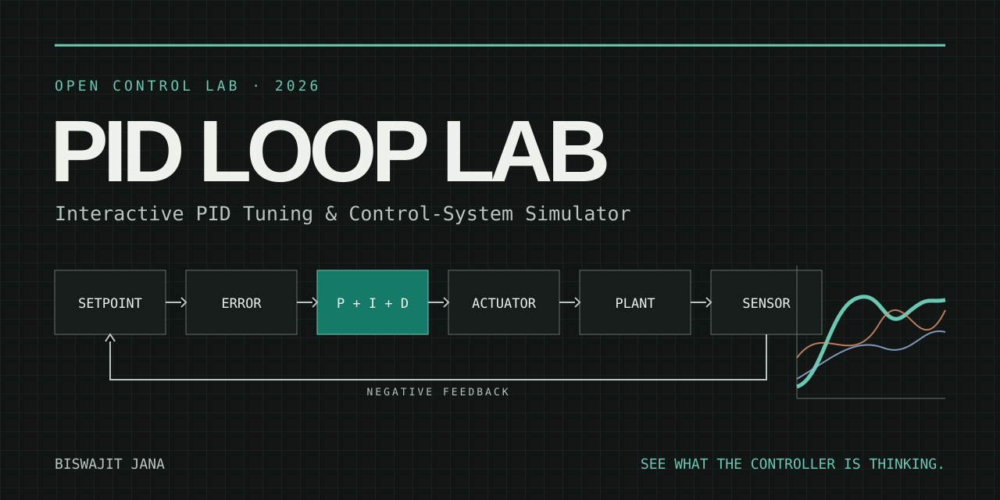
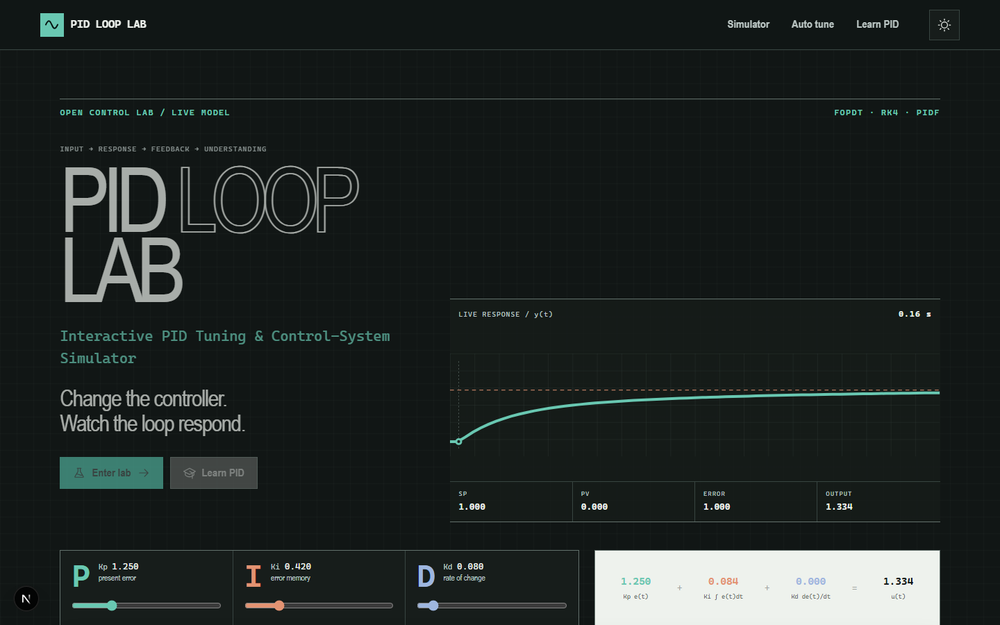
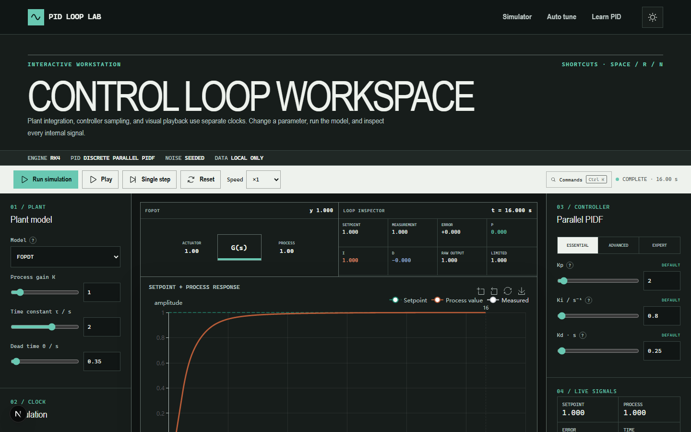

<div align="center">
  

# PID LOOP LAB

**Interactive PID Tuning & Control-System Simulator**

[Live demo](https://biswajit1999.github.io/pid-loop-lab/) · [Open the lab](https://biswajit1999.github.io/pid-loop-lab/lab/) · [Tuning methods](docs/tuning-methods.md) · [Validation](VALIDATION.md)

</div>

PID Loop Lab is a free, offline-capable browser laboratory for learning and exploring practical proportional–integral–derivative control. It is built around one question: **what is the controller thinking?**

## The instrument is the introduction



The opening scene is a running FOPDT simulation, not a decorative demo. Dragging P, I, or D recomputes the real controller response and updates the loop telemetry and term decomposition.



The laboratory keeps the plant, response, controller and internal signals spatially connected. Focus mode, shared cursors, event jumps and the loop inspector all read the same simulation sample.

The interface exposes setpoint, process value, error, P/I/D terms, unclamped command, bounded output, applied actuator value, saturation, disturbance, noise, and plant state. It uses real state equations and deterministic numerical integration rather than drawing approximate curves.

> Educational and preliminary engineering software. Generated gains, metrics, and code are not a hardware safety case, commissioning procedure, or substitute for validation on the actual plant.

## Highlights

- Parallel-form discrete PID/PIDF with typed and slider gain entry.
- Independent plant integration step, controller sample period, and visual playback rate.
- Derivative on measurement or weighted error, first-order derivative filtering, β/γ setpoint weights.
- Output/integrator limits, conditional anti-windup, back-calculation, and actuator slew limiting.
- First-order, FOPDT, second-order, integrating, mass–spring–damper, DC motor, generic thermal, and strictly proper user transfer-function plants.
- Seeded sensor noise and sample jitter, load disturbance, sensor lag, quantization, and dead time.
- Synchronized ECharts response, error, PID-term, controller, and actuator plots with zoom, pan, crosshair, legend, reset, and PNG/SVG export.
- Live plant visualization, time-linked loop inspector, event timeline, shared plot cursor, and full-screen response focus mode.
- Essential/advanced/expert controller disclosure, command palette, measured “What changed?” analysis, and lightweight run history.
- Rise/peak/settling time, overshoot/undershoot, steady-state and maximum error, IAE, ISE, ITAE, RMS error/effort, total controller variation, and saturation percentage.
- Ziegler–Nichols, Cohen–Coon, CHR, IMC/Lambda, SIMC, Tyreus–Luyben, and simulated Åström–Hägglund relay-feedback workflows.
- Four-way tuning overlay and metrics table without declaring a universal winner.
- PID term presets, time-constant explorer, second-order pole map, generic actuator/electrical view, CSV response import, CSV/JSON export, shareable URL state, and implementation-example code export.
- Light/dark themes, reduced-motion support, visible focus, keyboard controls, mobile stacking, and text summaries for plots.

## Governing controller

The implemented 2-DOF parallel structure is

```text
u = Kp(βr − y) + Ki ∫(r − y)dt + Kd d(γr − y)/dt
```

The derivative is filtered, the integral is sampled, and the unclamped sum is separated from the bounded controller output and slew-limited actuator value. See [controller forms](docs/controller-forms.md).

## Architecture

```text
UI controls ── Zustand configuration store
                         │
                         ▼
              deterministic batch simulator
                ├── discrete PID/PIDF
                ├── RK4 plant models
                ├── delay/sensor/actuator path
                └── numerical safety guards
                         │
             ┌───────────┼────────────┐
             ▼           ▼            ▼
        ECharts plots   metrics    CSV/JSON/share/code
```

Numerical code lives in `lib/` and is independent of React. Teaching presets, the main simulator, and autotuning comparisons all call the same engine.

## Scientific validation

The project validates plant integration, controller terms, filtering, saturation, anti-windup, delay, slew limiting, form conversions, metrics, tuning correlations, deterministic noise, and CSV parsing with Vitest. The research trail is published in:

- [Research landscape](docs/research-landscape.md)
- [References](docs/references.md)
- [Method validation](docs/method-validation.md)
- [Numerical methods](docs/numerical-methods.md)
- [Motion and interaction system](docs/motion-system.md)
- [Release validation](VALIDATION.md)

## Limitations

- A finite simulation is not a formal stability or robustness proof.
- Fixed-step methods need a sufficiently small `dt`; the dead time is quantized to the plant step.
- The transfer-function simulator supports strictly proper SISO models only.
- Frequency-domain analysis is withheld in v1 where it cannot be supported honestly across nonlinear effects.
- CSV v1 validates and previews experimental response data but does not claim robust model identification.
- Relay autotuning is simulated. Performing an ultimate-cycle or relay experiment on hardware can be unsafe.
- The generic electrical view is illustrative and does not describe every actuator.

## Install and develop

Requirements: Node.js 22.12 or newer and npm.

```bash
npm install
npm run dev
```

Open `http://localhost:3000`. Production checks:

```bash
npm run lint
npm run typecheck
npm test
npm run build
```

The Next.js application is statically exported and deployed by GitHub Actions. The numerical core requires no paid API and runs locally after the application loads.

## Keyboard

- `Space`: play/pause visual playback
- `R`: reset the playback cursor
- `N`: advance one stored simulation sample
- `F`: open the response plot in focus mode
- `C`: open tuning comparison
- `A`: open auto tuning
- `?`: show the keyboard map
- `Ctrl/Cmd + K`: open the command palette
- `Escape`: close focus mode or an overlay

Simulation shortcuts are ignored while focus is inside form fields; Escape and Ctrl/Cmd + K remain available.

## Contributing

Issues and focused pull requests are welcome. Scientific changes must include sources, controller form and units, applicability boundaries, and tests. Read [CONTRIBUTING.md](CONTRIBUTING.md).

## Citation

Use [CITATION.cff](CITATION.cff), or cite the repository and release version. The project bibliography is in [docs/references.md](docs/references.md).

## License

MIT — see [LICENSE](LICENSE).

---

Author: **Biswajit Jana**  
2026
